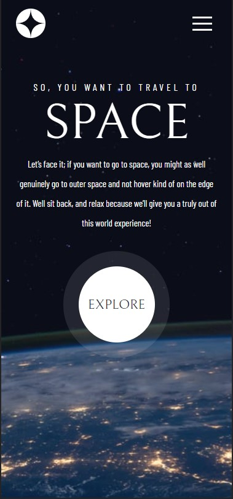

# Frontend Mentor - Space tourism website solution

This is a solution to the [Space tourism website challenge on Frontend Mentor](https://www.frontendmentor.io/challenges/space-tourism-multipage-website-gRWj1URZ3). Frontend Mentor challenges help you improve your coding skills by building realistic projects. 

## Table of contents

- [Overview](#overview)
  - [The challenge](#the-challenge)
  - [Screenshot](#screenshot)
  - [Links](#links)
- [My process](#my-process)
  - [Built with](#built-with)
  - [What I learned](#what-i-learned)
  - [Continued development](#continued-development)
- [Author](#author)


## Overview

### The challenge

Users should be able to:

- View the optimal layout for each of the website's pages depending on their device's screen size
- See hover states for all interactive elements on the page
- View each page and be able to toggle between the tabs to see new information

### Screenshot




### Links

- Solution URL: 
	Github - JS branch: https://github.com/PavelMelnik94/space-tourism/tree/React-JS
	Github - TS branch: https://github.com/PavelMelnik94/space-tourism/tree/React-TS

- Live Site URL: https://space-tourism-kappa.vercel.app/

## My process

### Built with

- Semantic HTML5 markup.
- CSS custom properties.
- Flexbox.
- [anme] https://www.npmjs.com/package/anme - Good styles utils.
- [React](https://reactjs.org/) - JS library.
- [react-animations + Styled Components] https://www.npmjs.com/package/react-animations - For animation Fade effect on load pages.

up:
- [TypeScript] - https://www.typescriptlang.org/

### What I learned

```css
root variables, simple animation.
```
```js
TypeScript interfaces, layout-hoc, sound on background with useSound hook.
```

### Continued development

hoc, js methods, animation, css grid.


## Author

- Website - [Pavel Melnik](https://portfolio.pavelmelnik.ru/)
